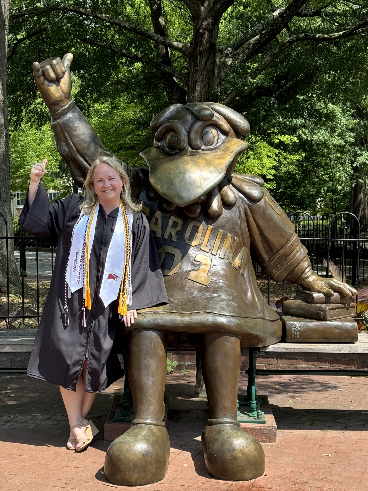

# I'm building a *second* career that I love.   

### The **Short** Version

After twelve years in the health insurance industry, I returned to college to pursue my passion for Geological Sciences. I embarked on a journey of rigorous study as a full-time undergraduate at the University of South Carolina (USC) from where I graduated in August 2024. This deliberate shift signified not only a change in profession but a profound realignment of my identity and life’s work towards understanding and preserving the delicate balance of our planet.

Now, I am pursuing a doctoral degree in Geosciences at Colorado State University where I study the subsurface dynamics of microplastics in soil near major U.S. river headwaters. My long-term goal is to conduct interdisciplinary research addressing critical knowledge gaps in anthropogenic environmental contamination. I aspire to work for the U.S. Department of the Interior, perhaps supporting the U.S. Geological Survey’s strategic vision for studying microplastics . For now, I remain committed to advancing my PhD research and mentoring the next generation of scientists through teaching and leadership roles.  

### Still reading? Here's the **full story**.

#### **Listening to my 'why'**

I recall being very contemplative in childhood. I asked questions in which no one around me expressed the slightest degree of interest. “Why are there fish in this lake but not in that pond? Why does my hometown not have mountains? How do rainbows happen?” I was curious then, and I am curious now. Instead of pondering the existence of rainbows, these days I find myself wondering how long humanity can survive on a warming planet. I ponder how much groundwater is available and how it moves through the rocks beneath our feet. I think about natural hazards and our ability to predict them.

Like many others over the past few years, I found time to contemplate bigger questions. I made time for introspection. I finally started to listen to myself and address my needs. **I examined the most important question of all, "What am *I* doing to find answers to these big questions?"**

I believe that addressing global challenges necessitates a seamless integration of contemplative thought and relentless action, highlighting the value that academia and private industry collectively bring to the table. Driven by this conviction, I transitioned from a stable career to the academic world, committing myself to the study of Geological Sciences. This deliberate shift signifies not just a change in profession but a profound realignment of my identity and life’s work towards understanding and preserving the delicate balance of our planet's geological framework. 

#### **Emerging from the Shadow of First-Generation Disadvantage**

I have always wanted to be a part of the team of global scientists that are working tirelessly to understand our planet and the challenges it’s facing. However, my life's journey and my career decisions did not support that goal until very recently.

**My path has been wildly non-linear.** I grew up in a small town. My parents worked hard but did not have much. I was a straight-A student through high school and excelled in sports and creative pursuits. I received early-admission to Montclair State University in Montclair, NJ in 2002. I took out loans to pay for my education. My future seemed bright and full of potential despite my socioeconomic background.

I was immediately drawn to the sciences, always wondering how a thing came to exist in the natural world. However, my parents urged me to consider what they perceived to be a more lucrative career and strongly encouraged me to major in Business Administration. I understood their perspective, so I heeded their advice. I diligently attended classes my freshman year earning a 3.9 GPA. **My parents were proud, but I felt less fulfilled by the day.** I remember asking myself if this newfound knowledge was going to help anyone or improve society in any meaningful way. Then, I transferred to Coastal Carolina University in Conway, SC in 2004 and declared a major of Marine Science. My parents were bewildered, and their tactics changed slightly. I was inundated with questions about how I would make a living or balance my future family's needs while ‘living on a boat.’ They pleaded with me to find a more common major with which I could ‘do anything,’ so I switched my major back to Business Administration.

I know their intentions were good, but it undermined my confidence. **As a first-generation college student, I had no role models that pursued higher education.** I did not understand academia and I did not see a direct correlation between my degree and future career options. I faltered, and a viscous cycle emerged where I started working more hours, fearful of not repaying my student loans. I had less time to complete homework assignments, so my grades suffered. As my grades declined, **I began to disconnect from my aspirational academic goals, being slowly pulled back to the world from which I came; a world focused entirely on financial stability and traditional gender roles.**

**I withdrew from college in 2006 and entered the corporate workforce**. Over many years, my strong work ethic, perseverance, and creative problem-solving abilities led to progressive career advancement despite my lack of a college degree. I have held many roles over the years. I have managed large projects, led small teams, conducted business testing, administered technology solutions, taught courses in data visualization, and served as a trusted advisor to executive teams. I embodied normative societal success and achieved that understandably desired financial stability. While I discovered amazing people, small wins, and joyful moments throughout these milestones, I remained unfulfilled. I lacked purpose and sufficient mental stimulation. My work was not aligned with my values and interests. I knew I needed change. Yet I never imagined the form it would take. 

#### **Getting it right the *second* time**

Allow me to fast-forward to a seemingly innocent conversation in 2022 with my spouse during which I was lamenting the dichotomy between the change I wished to see in the world and the change I was actually \[not\] making. I vividly recall him saying, "What's stopping you? Go do it." In what was surely an ego-driven, knee-jerk response to his challenge at the time, I applied to the University of South Carolina - Sumter *that evening*.

As the saying goes, 'the rest is history.' I have not looked back since. I began taking online classes while working full-time. I received my Associate in Science shortly thereafter from the University of South Carolina - Sumter and walked away from my career to pursue a bachelor’s degree full-time at the University of South Carolina – Columbia (USC) in 2022. **I graduated Summa cum Laude with Distinction in Geological Sciences and Leadership Distinction in Research in August 2024.** 

#### **Finally *living* my 'why'**

 My goals these days are simple. I am not concerned with using a specific geochemical analysis, dating technique, mathematical model, or technology in my research. I am only interested in two things. First, I wish to work with other scientists that inspire me—those that blur the boundaries between disciplines and develop innovative methods. Second, I endeavor to only select projects and partner with institutions conducting research that addresses major environmental issues. These two simple principles influence all the education- or career-related decisions in my life now.

**It is in this spirit that I embarked upon my graduate school journey in Fall 2024. I accepted an exceptional offer from Colorado State University in Fort Collins, Colorado to pursue a Doctoral degree in Geological Sciences under Sedimentologist Dr. Rebecca VanderLeest. Together, we are trying to unravel the subsurface dynamics of microplastics in soil near major U.S. river headwaters.**
