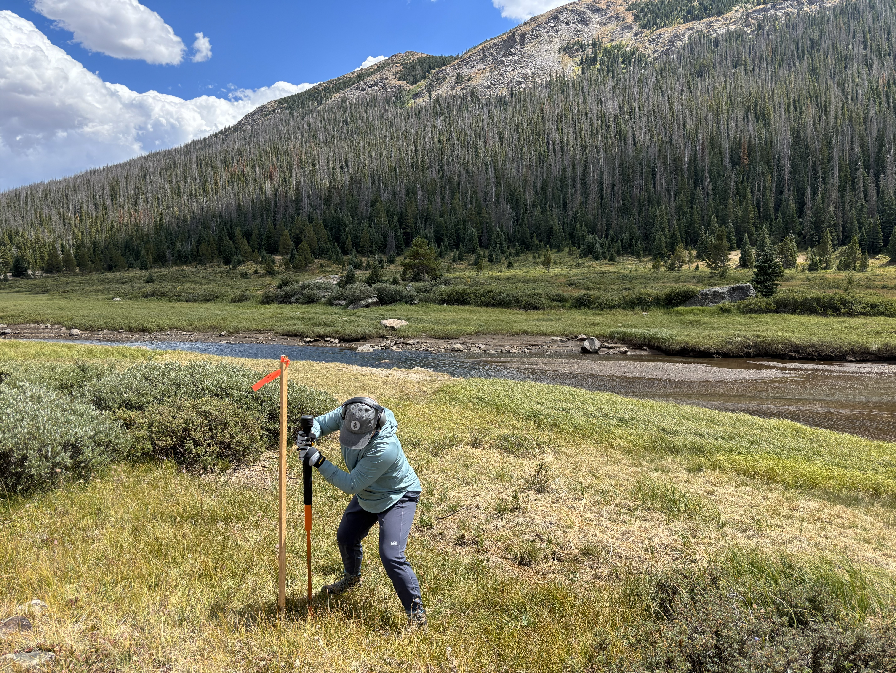

# Welcome! I'm glad you're here.   

I’m Ashley Ford, a PhD student at Colorado State University, fascinated by the journey of microplastics through soils and watersheds. My research combines fieldwork, lab analysis, and geospatial modeling to understand how natural landscapes and soil properties shape the fate of microplastics in the environment.

This site highlights my research, shares insights from my fieldwork, and provides resources for students and fellow scientists curious about microplastics and environmental geoscience.  

{width="100%"}
