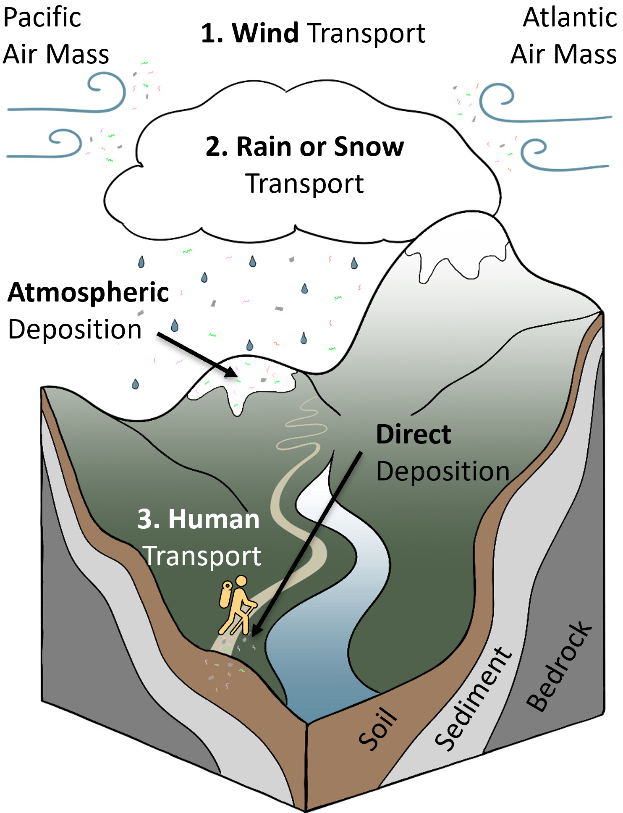
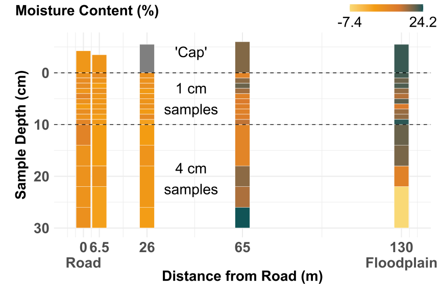
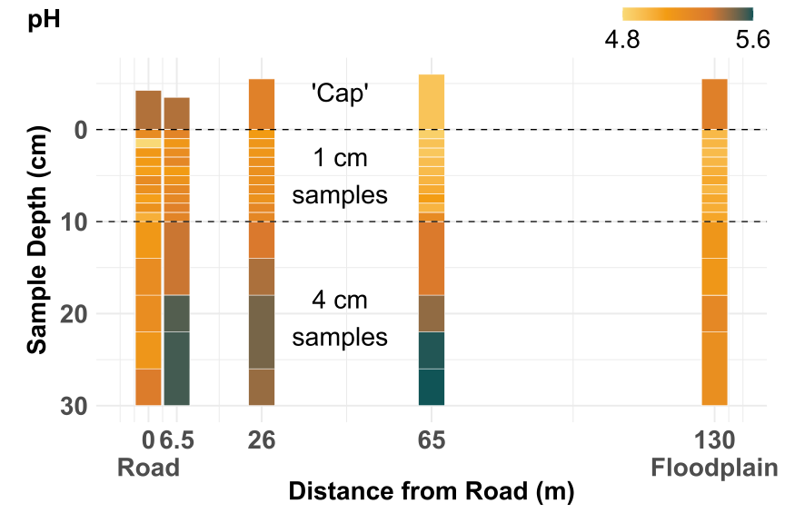
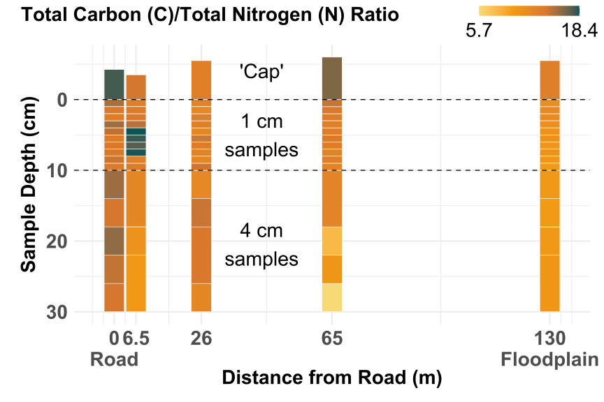
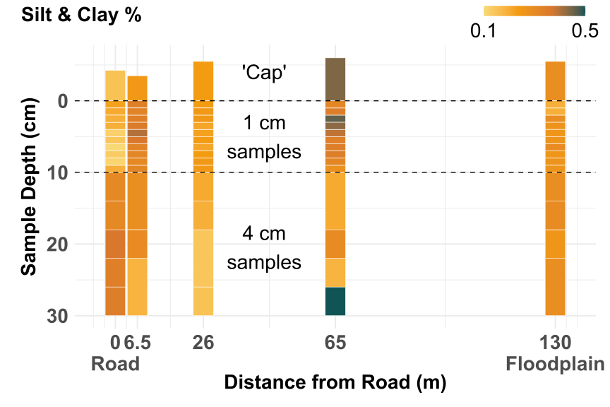
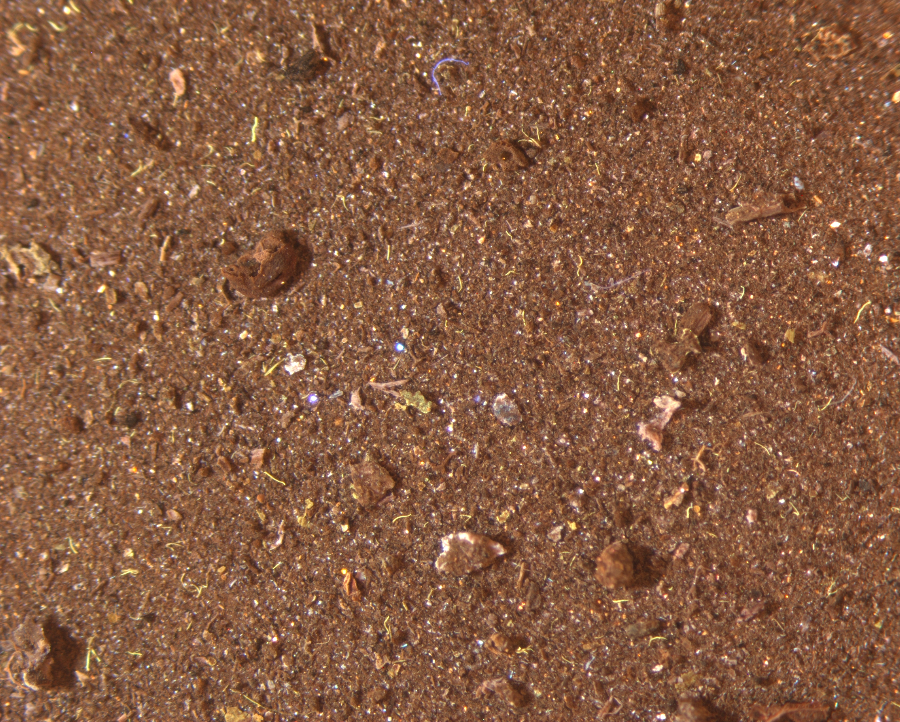
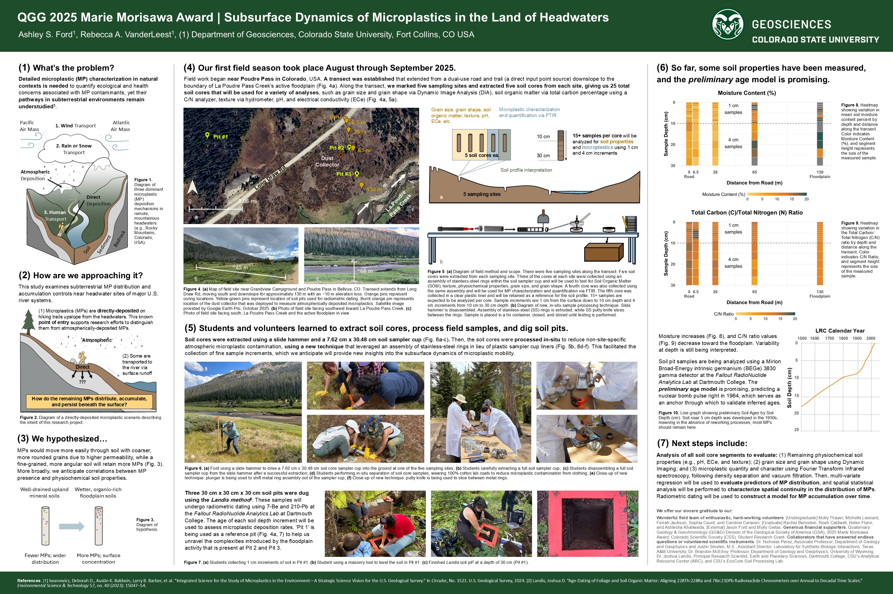

# I study the subsurface dynamics of microplastic in soil near U.S. headwater sites. <br><br>

## **Why the big fuss about microplastics?**

### *First, let's define the term 'microplastic.'*

Small plastic particles are typically classified as nano- or micro-plastics based on their size. Nanoplastics are particles of \<=1 $\mu$m (micron/micrometer), while **microplastic particles can range from 1$\mu$m to 5 mm**. These particles are further categorized by how they are created. They are referred to as "primary" if they were intentionally manufactured in the nano to micro size range of 1$\mu$m to 5 mm (e.g., beads for jewelry, plastic abrasion additives in cosmetics, exfoliants, or face wash). Whereas, "secondary" nano- or micro-plastics are the result of mechanical or chemical breakdown of larger plastic items in the environment (e.g., medical supplies, laundry detergent bottles, water bottles, etc.)^1^.

### *Are they harmful?*

**Yes.** Studies have shown that microplastic (MP) contamination can reduce nutrient absorption when ingested and result in contamination hot spots due to other harmful contaminants adsorbing to their surface (e.g., heavy metals, pesticides, pharmaceuticals and pathogens).

### *What do we \[not\] know about them?*

<figure style="float: right; width: 400px; margin: 1em 1em 1.5em 1em;">



```{=html}
<figcaption style="display: block; width: 100%; box-sizing: border-box; 
                     white-space: normal; overflow-wrap: break-word; 
                     text-align: center; padding-left: 0.50rem;">
```

Diagram of three dominant microplastic (MP) deposition mechanisms in remote, mountainous headwaters (e.g., Rocky Mountains, Colorado, USA).

</figcaption>

</figure>

Humans first discovered the [Great Pacific Garbage Patch](https://education.nationalgeographic.org/resource/great-pacific-garbage-patch/){target="_blank"} in 1997, which led to extensive microplastic research in the marine environment. We have now found them in the deepest parts of our oceans (e.g., Mariana Trench), the most remote mountain tops, and on glaciers. They are, as the literature emphasizes, *ubiquitous*. Microplastics have been found in every corner of our planet, even in places previously never visited by modern humans. This has led to work in recent years to determine how those plastic particles have reached these remote regions of the world. More recently, scientists have begun modeling the atmospheric transport of microplastic contamination via wind, rain, and snow.

Despite this incredible progress, **we still know very little about how microplastics behave in soil^2^.**

::: {style="clear: both;"}
:::

<br>

{width="80%" align="center"}

::: {style="clear: both;"}
:::

<br>

## **How am I addressing it?**

**This study examines subterrestrial MP distribution and accumulation controls near headwater sites of major U.S. river systems by:**

-   Quantifying and characterizing microplastics in finely, vertically sampled soils to determine the predictors and spatial continuity of microplastic distribution

-   Using 7-Be and 210-Pb radiometric dating to construct a model for microplastic accumulation over time

We established a transect from a dual-use road/ trail downslope to the Cache La Poudre River in northern Colorado and collected 25 soil cores across five sites. We also excavated three soil pits and deployed a passive atmospheric dust collector. MPs are being isolated by density separation, grains characterized with a Dynamic Image Particle Analyzer, and soil properties quantified (e.g., moisture, organic matter, and texture).

::: {style="clear: both;"}
:::

<br>

![Map of field site near Grandview Campground and Poudre Pass in Bellvue, CO. Transect extends from Long Draw Rd, moving south and downslope for approximately 130 m with an \~10 m elevation loss. Orange pins represent coring locations. Yellow-green pins represent location of soil pits used for radiometric dating. Burnt orange pin represents location of the dust collector that was deployed to measure atmospherically deposited microplastics. Satellite image provided by Google Earth Pro, October 2025.](images/Field%20Site_GC.png){width="100%" align="left"}

<br>

{width="100%" align="left"}

::: {style="clear: both;"}
:::

<br>

## **What have I learned so far?**

In Fall 2025, my work focused on understanding common soil properties that may ultimately influence microplastic distribution. These include soil moisture, pH, electrical conductivity (EC), soil organic matter (SOM) content via Total Carbon/Total Nitrogen, and soil texture via hydrometer. The resulting distributions are displayed below and the interpretations are forthcoming. **Microplastic analysis, radiometric dating, as well as grain size and grain shape distribution assessment via Dynamic Image Analysis will occur in Spring 2026.**

::: {style="clear: both;"}
:::

```{r, message=FALSE, warning=FALSE, echo=FALSE}
# GATHER AND MANIPULATE DATA

# 1. Run setup script and import desired fonts for visualizations.

# Setup script
source("Setup_af.R")
message=FALSE
warning=FALSE
echo=FALSE

# Text packages (required step for using the Arial font system in Windows; already installed the "showtext" package in the Setup script. Only needs to be done once per machine, supposedly. Leaving it here for now.)

font_add("Arial", regular = "C:/Windows/Fonts/arial.ttf")  # Windows path
font_add("ArialBold", regular = "C:/Windows/Fonts/arialbd.ttf")  # Windows path
showtext_auto()  # enables automatic use of showtext

# 2. Import data sources.

### a. Total Carbon and Nitrogen (as cn_data): Measured by the Velp Elemental Analyzer in the EcoCore lab on 9/23/2025. 
### b. Soil Moisture (as soil_moisture)
### c. pH and EC (as ph_ec): Measured at EcoCore in 11/5-11/7/2025.
### d. Soil Particle Texture Analysis via Hydrometer: Measured at EcoCore in 11/11/25-11/20/25.

# Read the data
cn_data <- read_excel("data/C_N_Analysis_GC2025_AshleyFord.xlsx", sheet = "CN 802")

soil_moisture <- read_excel("data/Grandview Campground (GC)_Soil CORE Results.xlsx", sheet = "Recombined Samples")

ph_ec <- read_excel("data/Grandview Campground (GC)_Soil CORE Results.xlsx", sheet = "pH&EC")

texture <- read_excel("data/Grandview Campground (GC)_Soil CORE Results.xlsx", sheet = "Texture")

# 3. Join the data sources to create a master.

### a. First, make sure each data source has a Sample ID field that is consistently formatted with the same name.

# Desired format: <test>_<location> <distance>_<year>_<sample id>
# Example of desired format: SOM-TEX_GC 130_2025_01-02

cn_data <- cn_data %>%
  mutate(new_sample_id=sample_name)

# soil_moisture requires no changes to new_sample_id.
  
ph_ec <- ph_ec %>%
  mutate(new_sample_id=Sample)

texture <- texture %>%
  mutate(new_sample_id=sample_id)

### b. Remove any non-essential rows that were generated for instrument calibration (duplicates, blanks, standards, etc.).

cn_data_clean <- cn_data %>%
  filter(grepl("SOM-TEX", sample_name)) # Removed "Blanks" and "SID High" validation samples.

# soil_moisture contains duplicate records that were created when we combined our samples with the same depth into a larger, more homogeneous sample. 

soil_moisture_clean <- soil_moisture %>% 
  filter(test == "SOM") #By only selecting "SOM", we ignore the identical "TEX" records.

# ph_ec requires no changes at this time.
ph_ec_clean <- ph_ec

# texture requires no changes at this time.
texture_clean <- texture

### c. Control the scope of the analysis by including/excluding specific samples.

# c1. Control the inclusion/exclusion of the "Caps" (sample 21). 

#cn_data_clean <- cn_data_clean %>%
  #filter(!str_detect(sample_name,"21"))

#soil_moisture_clean <- soil_moisture_clean %>% 
  #filter(!str_detect(new_sample_id, "21"))

#ph_ec_clean <- ph_ec_clean %>%
  #filter(!str_detect(new_sample_id, "21"))

#texture_clean <- texture_clean %>%
  #filter(!str_detect(new_sample_id, "21"))

### d. Join the cleaned data sets.

combined_data <- left_join(x=soil_moisture_clean, y=ph_ec_clean, by="new_sample_id") 
combined_data <- left_join(x=combined_data, y=cn_data_clean, by="new_sample_id")
combined_data <- left_join(x=combined_data, y=texture_clean, by="new_sample_id")

# 4. Perform calculations that will further refine the combined data set. 

### Note: The above join created a data set containing 107 records. However, we should only see 80 records. The soil_moisture_clean data set still contains too many records.

combined_data_clean <- combined_data %>%
  group_by(new_sample_id) %>%
  mutate(
    field_depth_range_cm = str_replace_all(field_depth_range_cm, "Cap", "0"),
    clean_depth = str_replace_all(field_depth_range_cm, "[^0-9\\-]", ""),
    max_sample_depth = as.numeric(str_extract(clean_depth, "^\\d+")),
    
    lab_dry_cap_height = str_trim(lab_dry_cap_height),
    lab_dry_cap_height = ifelse(lab_dry_cap_height %in% c("NA", "", " "), NA, lab_dry_cap_height),
    lab_dry_cap_height = str_extract(lab_dry_cap_height, "\\d*\\.?\\d+"),  # grab the numeric part only
    lab_dry_cap_height = as.numeric(lab_dry_cap_height),
    
    sample_increment = if_else(max_sample_depth == 0, lab_dry_cap_height, if_else(max_sample_depth <= 10, 1, 4)),
    distance_from_road_m = substr(core, 4, 7),
    distance_from_road_m = recode(distance_from_road_m,
                                  'Road' = 0,
                                  `6.5` = 6.5,
                                  `26`  = 26,
                                  `65`  = 65,
                                  `130` = 130),
    distance_from_road_m = as.numeric(distance_from_road_m)
  ) 

# 5. Perform analytical calculations.

combined_data_filtered <- combined_data_clean %>%
  group_by(new_sample_id) %>%
  mutate(
    mean_c_n = mean(c_mg, na.rm=TRUE)/mean(n_mg, na.rm=TRUE),
    mean_sample_wt_wet_g = mean(lab_wet_subsample_wt_excl_storage_vessel_wt_g, na.rm = TRUE),
    mean_sample_wt_dry_g = mean(lab_dry_subsample_wt_excl_drying_vessel_wt_g, na.rm = TRUE),
    mean_soil_moisture = ((mean_sample_wt_wet_g - mean_sample_wt_dry_g)/mean_sample_wt_dry_g) * 100,
    sample_increment = sum(sample_increment),
    depth_mid = max_sample_depth - (sample_increment/2) #Convert the appropriate 'height' or placement of the tiles.
  ) %>%
  ungroup() %>%
  filter(!max_sample_depth %in% c(28, 24, 20, 16, 12)) # IMPORTANT: This drops duplicate sample IDs.

# 6. Select only the columns of interest for reporting and only keep unique records.

combined_data_final <- 
  unique(combined_data_filtered %>%
           select(sample_id = new_sample_id, core, mean_soil_moisture, distance_from_road_m, `ph_1-2_di_h2o`, `ec_1-2_di_h2o_micromho`, 'c_%', 'c_mg', 'n_%', 'n_mg', mean_c_n, field_depth_range_cm, max_sample_depth, sample_increment, depth_mid, `silt_%`, `silt_clay_%_40_s`, `sand_%`))
```

```{r setup, warnings=FALSE, message=FALSE, echo = FALSE, out.width="100%", out.height="100%",dev="svg"}

# 7. Use a function to interate through test variables to create a series of identical heatmaps. 

### a. List the arguments that will be fed to the function.

fills <- c('mean_c_n', 'mean_soil_moisture', 'ph_1-2_di_h2o', 'ec_1-2_di_h2o_micromho', 'silt_clay_%_40_s', 'sand_%')
filenames <- c("figures/cn.svg", "figures/moisture.svg", "figures/ph.svg", "figures/ec.svg", "figures/silt_clay.svg", "figures/sand.svg")
plots <- c('cn_ratio', 'soil_moisture', 'ph', 'ec', 'silt_clay', 'sand')
legend_names <- c("C/N Ratio", "Moisture Content (%)", "pH", "EC", "Silt & Clay %", "Sand %")
titles <- c("Total Carbon (C)/Total Nitrogen (N) Ratio", "Moisture Content (%)", "pH", "Electrical Conductivity (EC), \u00B5S/cm", "Silt & Clay %", "Sand %")
sizes <- c("C/N Ratio", "Moisture Content (%)", "pH", "EC", "Silt & Clay %", "Sand")
colors <- c("C/N Ratio", "Moisture Content (%)", "pH", "EC", "Silt & Clay %", "Sand")

### b. Convert these into a single tibble so they can be used with pmap(). 

map_param <- tibble(
  fills = fills,
  filenames = filenames,
  plots = plots,
  #legend_names = legend_names,
  titles = titles,
  sizes = sizes,
  colors = colors
)

### c. Create the graphing function.

suppressWarnings(
  suppressMessages(
plot_per_variable <- function(fills, filenames, plots, titles, sizes, colors){ # Removed legend_names
  fill_sym <- sym(fills)
  
  p <- ggplot(combined_data_final, aes(x=distance_from_road_m, y=depth_mid, fill=!!sym(fills))) +
  geom_tile(aes(width=6, height=sample_increment), color="white", size=0.3, na.rm=TRUE) +
  geom_hline(yintercept = 10, color = "black", linewidth = 0.6, linetype = "dashed") +
  geom_hline(yintercept = 0, color = "black", linewidth = 0.6, linetype = "dashed") +

  annotate("text", x = 44, y = 5, label = "'Cap'", 
           size = 10, hjust = 0.5, vjust = -4, family="Arial") + 
  annotate("text", x = 44, y = 5, label = "1 cm\nsamples", 
         size = 10, hjust = 0.5, vjust = 0.5, family="Arial") + 
  annotate("text", x = 44, y = 15, label = "4 cm\nsamples", 
         size = 10, hjust = 0.5, vjust = 1.4, family="Arial") +

  scale_fill_gradientn(
    colors = c("#f9d976", "#f39c12", "#d9782d", "#105456"),
    limits = range(combined_data_final[[fills]], na.rm=TRUE),   # force the scale to go from 0 to 20
    oob = scales::squish,  # optional: ensures values outside the range get squished to min/max
    breaks = range(combined_data_final[[fills]], na.rm=TRUE), # show min, mid, max
    labels=scales::label_number(accuracy=0.1),
    name = "", # Removed legend_names
    guide = guide_colorbar(
      title.position = "top",   # move title above color bar
      title.hjust = 1,        # 0 = left, 0.5 = center, 1 = right
      #title.vjust = 1,
      barwidth = 10,            # control length of color bar
      barheight = 1,             # control thickness
    )
  ) +
    
  scale_x_continuous(limits=c(-5,135), breaks = c(0, 6.5, 26,65, 130), labels = c("0\nRoad", "6.5", "26", "65", "130\nFloodplain")) +

   labs(
    title = titles, 
    x = "Distance from Road (m)",
    y = "Sample Depth (cm)", 
    size = sizes,
    color = colors) +
    scale_radius(range = c(0, 10)) + 
    theme_minimal(base_size=20) +
    scale_y_reverse() +
  
  theme(
    #Text
    text=element_text(family="ArialBold"),
    
    #Title
    plot.title = element_text(face = "bold", size = 28, hjust = 0, margin = margin(t=0,l=10, b =-60)),
    plot.title.position = "plot",
    
    #Subtitle
    plot.subtitle = element_text(size = 20, hjust = 0.5, margin = margin(b = 10)),
    
    #Axes
    axis.title.x = element_text(size = 28, face = "bold", margin = margin(t=0,b=5)),
    axis.title.y = element_text(size = 28, face = "bold", margin = margin(l=10,r=10)),
    axis.text = element_text(size = 28, margin = margin(l=10,r=10)),
    
    #Legend
    legend.title = element_text(size=24, family="Arial"),
    legend.text = element_text(size=28, family="Arial"),
    legend.position="top",
    legend.justification="right",  
    legend.box.just="right",
    legend.title.align = 0.5,
    legend.margin = margin(b = -15, r=15),
    
    #Margins
    plot.margin=margin(t=10,r=20,b=15,l=20),  #t=15,r=20,b=15,l=20
    
    #Caption
    plot.caption = element_text(size = 14, hjust = 0, face = "italic"),
    plot.caption.position = "plot"
    )
  
    ggsave(
    filename = filenames,
    plot = p,
    width = 12, 
    height = 8, 
    units = "in" #inches
    )
  
  message(paste("Saving plot:", plots))

  return(p)
}
))

### d. Call the function.
suppressWarnings(
  suppressMessages(
all_individual_plots <- pmap(map_param, plot_per_variable)))
```

### *Soil Moisture*

Soil moisture helps us infer the impact of water as a transport medium for microplastics in soil. Water flow is believed to carry microplastics deeper into the soil profile, altering their distribution patterns.<br><br>

{width="100%"}

### *pH*

pH is a primary control on soil and microplastic mobility within the soil. Alkaline soils are generally more negatively charged, which can create repelling forces between the soil and aged microplastics (which also become more negatively charged with age).<br><br>

{width="100%"}

### *Total Carbon/Total Nitrogen Ratio*

The Total Carbon/Total Nitrogen Ratio (C/N) can provide insights into a soil's capacity to retain or mobilize microplastics. It is a reflection of soil organic matter (SOM) quality and microbial activity, which impacts the microplastic's ability to attach or detach from the material around it.<br><br>

{width="100%"}

### *Soil Texture*

It is well established that soil texture plays a vital role in microplastic movement. Fine soils can trap microplastics effectively, while coarse-grained soils with larger pore spaces allow faster water and microplastic movement.<br><br>

{width="100%"}

::: {style="clear: both;"}
:::

<br>

## **What's next?**

<figure style="float: right; width: 450px; margin: 1em 0 1.5em 1em;">



```{=html}
<figcaption style="display: block; width: 100%; box-sizing: border-box; 
                     white-space: normal; overflow-wrap: break-word; 
                     text-align: center; padding-left: 0.50rem;">
```

Image of isolated microplastics at 17.2x zoom. Microplastics have been treated with DANS to fluoresce.

</figcaption>

</figure>

-   Grain size and grain shape analysis (via DIA)

-   **Microplastic quantification and characterization using Fourier Transform Infrared spectroscopy**

-   Multi-variate regression to evaluate predictors of MP distribution

-   Characterization of spatial continuity

-   Construction of a model for MP accumulation over time

::: {style="clear: both;"}
:::

<br>

## **Products**

The current status of this research was most recently shared at GSA Connects 2025 in San Antonio, TX, Colorado State University's 2025 Graduate Student Showcase in Fort Collins, CO, and the Colorado Scientific Society's 2025 Student Poster Night in Golden, CO.

{width="100%"}

::: {style="clear: both;"}
:::

<br>

## **Acknowledgments**

I would like to thank the following organizations and individuals for making this interdisciplinary research possible.

**Our wonderful field team of enthusiastic, hard-working volunteers**: \[Undergraduate\] Molly Thayer, Michelle Leonard, Ferrah Jackson, Sophia Caunt, and Caroline Caravan; \[Graduate\] Rachel Bernstein, Noah Caldwell, Helen Flynn, and Ashlesha Khatiwada; \[External\] Jason Ford and Molly Gielas. **Generous financial supporters**: Quaternary Geology & Geochronology (QG&G) Division of the Geological Society of America (GSA), 2025 Marie Morisawa Award; Colorado Scientific Society (CSS), Student Research Grant. **Collaborators**: Dr. Nicholas Perez, Associate Professor, Department of Geology and Geophysics and Justin Smolen, M.S., Assistant Director, Laboratory for Synthetic-Biologic Interactions, Texas A&M University; Dr. Brandon McElroy, Professor, Department of Geology and Geophysics, University of Wyoming; Dr. Joshua Landis, Principal Research Scientist, Fallout RadioNuclide Analytics Lab Earth and Planetary Sciences, Dartmouth College; CSU’s Analytical Resource Center (ARC), and CSU’s EcoCore Analytical Facility.

::: {style="clear: both;"}
:::

<br>

## **References**

\[1\] Tirkey, Anita, and Lata Sheo Bachan Upadhyay. “Microplastics: An Overview on Separation, Identification and Characterization of Microplastics.” Marine Pollution Bulletin 170 (September 2021): 112604. <https://doi.org/10.1016/j.marpolbul.2021.112604>.

\[2\] Iwanowicz, Deborah D., Austin K. Baldwin, Larry B. Barber, et al. “Integrated Science for the Study of Microplastics in the Environment—A Strategic Science Vision for the U.S. Geological Survey.” In Circular, No. 1521. U.S. Geological Survey, 2024. <https://doi.org/10.3133/cir1521>.

\[3\] Landis, Joshua D. “Age-Dating of Foliage and Soil Organic Matter: Aligning 228Th:228Ra and 7Be:210Pb Radionuclide Chronometers over Annual to Decadal Time Scales.” Environmental Science & Technology 57, no. 40 (2023): 15047–54. <https://doi.org/10.1021/acs.est.3c06012>.